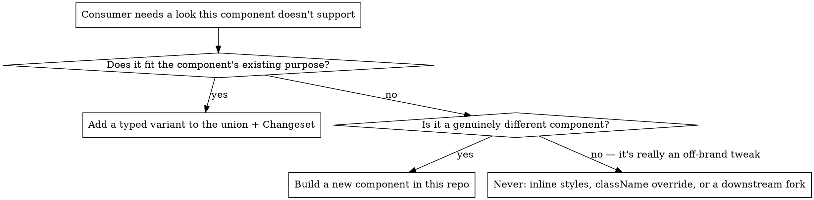

# Component API Design (this repo)

## Overview

Every public component in `src/index.ts` has a **closed** prop surface: variants are string-literal unions, not `className`/`style` passthrough or free-form values. This isn't a style preference — it's the enforcement mechanism that keeps off-brand values from entering consuming projects, since those repos consume this package by version, not by copy-paste, and can't be manually reviewed on every use.

## When to Use

- Designing props for a new component
- A consumer (real or hypothetical) wants a look the component doesn't currently support
- Reviewing a PR that adds a prop, especially `className`, `style`, `color`, or any `string`-typed prop that isn't a union
- Deciding whether new behavior belongs as a prop, a variant, or a whole new component

## The Core Pattern: Variant Owns Everything It Implies

Look at `Badge` in this repo — `variant` alone determines label text, color, and animation. There is no separate `label`/`color`/`pulse` prop, so a caller cannot combine them into an off-brand pairing:

```tsx
export type BadgeVariant = "main-quest" | "side-quest" | "legacy" | "in-development";

const LABEL: Record<BadgeVariant, string> = {
  "main-quest": "MAIN QUEST",
  "side-quest": "SIDE QUEST",
  legacy: "LEGACY",
  "in-development": "IN DEVELOPMENT",
};
const PULSES: Record<BadgeVariant, boolean> = {
  "main-quest": true,
  "side-quest": false,
  legacy: false,
  "in-development": true,
};

export interface BadgeProps {
  variant: BadgeVariant;
}

export function Badge({ variant }: BadgeProps) {
  return (
    <span className={`ds-badge ds-badge--${variant}`}>
      {PULSES[variant] && <span className="ds-badge__dot" aria-hidden="true" />}
      {LABEL[variant]}
    </span>
  );
}
```

Compare `Cta`'s `variant: "primary" | "secondary" | "ghost"` — the TSDoc on the type documents *scope*, not just appearance ("`primary` is scoped to game-card demo-play contexts... don't reach for it outside a game card just because it's the boldest option"). A closed union is only doing its job if the doc comment tells the next agent *when*, not just *what*.

## Decision: New Look Needed — Prop, Variant, or Fork?



Both real answers land back in this repo, with a Changeset. There's no third path.

## Composition, When You Need It

`children: ReactNode` and structural props (`href`, `onClick`) are fine — they carry content and behavior, not styling. `Cta` renders `<a>` vs `<button>` based on whether `href` is set, which is a legitimate structural branch, not a style escape hatch:

```tsx
export interface CtaProps {
  variant: CtaVariant;
  children: ReactNode;
  href?: string;
  onClick?: () => void;
}
```

For genuinely composed components (a card with a header/body/footer), prefer subcomponents (`Card.Header`, `Card.Body`) over a dozen boolean/content props — but each subcomponent still only accepts closed props, same rule.

## Common Mistakes

| Mistake | Why it's wrong | Fix |
|---|---|---|
| Adding `className?: string` "for flexibility" | Reopens the exact hole closed props exist to close — a consumer will eventually pass an off-brand value | Add a variant instead |
| Adding `color?: string` or `style?: CSSProperties` | Same as above, worse — bypasses tokens entirely | Derive color from `variant`, like `Badge` does |
| A new prop that's `string` instead of a literal union | TypeScript can't catch invalid values; `check-api` won't flag drift either | Use a string-literal union and export the type |
| Widening an existing union "just to unblock this PR" | This is exactly what the `check-api` gate exists to catch — a deliberate API change needs a Changeset, not a quiet edit | Run `pnpm run update-api` deliberately, add a Changeset, get the change reviewed as a real API decision |
| Forking the component downstream instead of extending it here | Governance (tokens, a11y, visual regression) only applies to this repo — a fork drifts silently | Add the variant here, publish a new version |
