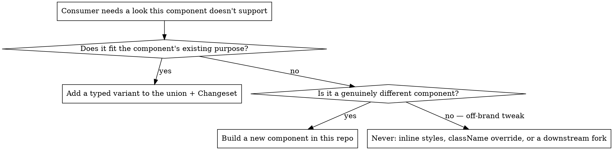

# Component API Design (this repo)

## Overview

Every public component in `src/index.ts` has a **closed** prop surface: variants are
string-literal unions, not `className`/`style` passthrough or free-form values. Consuming
apps install `@teamstep/design-system` by version — closed props are what keep off-brand
values out when those apps aren't reviewed on every use.

## When to Use

- Designing props for a new component
- A consumer wants a look the component doesn't support
- Reviewing a PR that adds a prop (`className`, `style`, `color`, or open `string`)
- Deciding prop vs variant vs new component
- A pattern repeats across feature folders and someone wants a new primitive

## Ownership note

- **New look → typed variant + Changeset in this repo.** Never consumer fork or inline override.
- **Primitive promotion** (after the same pattern appears in ≥3 feature components) requires
  sign-off from **@hoonsubin**. Agents flag the candidate; they do not invent primitives to
  unblock a PR. See `design-system-governance`.

## The Core Pattern: Variant Owns Everything It Implies

`Badge` — `variant` alone determines label, color, and pulse (no separate props to combine
off-brand):

```tsx
export type BadgeVariant =
  | "main-quest"
  | "side-quest"
  | "legacy"
  | "in-development"
  | "released"
  | "prototype"
  | "portfolio";

export interface BadgeProps {
  variant: BadgeVariant;
}
```

`Cta`'s `variant` documents *scope* in TSDoc, not just appearance (`primary` is
game-card-scoped via game-green — don't use it as generic "boldest" chrome). Closed unions
only work if the doc says *when*, not only *what*. Keep a one-line summary under `@public`
(api-extractor marks tag-only exports undocumented).

## Decision: New Look — Prop, Variant, or Fork?


```dot
digraph decision {
  "Consumer needs a look this component doesn't support" [shape=box];
  "Does it fit the component's existing purpose?" [shape=diamond];
  "Add a typed variant to the union + Changeset" [shape=box];
  "Is it a genuinely different component?" [shape=diamond];
  "Build a new component in this repo" [shape=box];
  "Never: inline styles, className override, or a downstream fork" [shape=box];

  "Consumer needs a look this component doesn't support" -> "Does it fit the component's existing purpose?";
  "Does it fit the component's existing purpose?" -> "Add a typed variant to the union + Changeset" [label="yes"];
  "Does it fit the component's existing purpose?" -> "Is it a genuinely different component?" [label="no"];
  "Is it a genuinely different component?" -> "Build a new component in this repo" [label="yes"];
  "Is it a genuinely different component?" -> "Never: inline styles, className override, or a downstream fork" [label="no — off-brand tweak"];
}
```

Both real answers land back here with a Changeset. No third path.

## Composition

`children: ReactNode` and structural props (`href`, `onClick`) are fine — content/behavior,
not styling. Prefer subcomponents (`Card.Header`) over boolean sprawl; each subcomponent
still uses closed props.

At most one `@hatch` closed union per primitive (registered in `tsdoc.json`), named by the
dimension that varies (e.g. border geometry), not just color.

## Common Mistakes

| Mistake | Why it's wrong | Fix |
|---|---|---|
| `className?: string` "for flexibility" | Reopens the hole closed props exist to close | Add a variant |
| `color?: string` / `style?: CSSProperties` | Bypasses tokens | Derive from `variant` |
| Open `string` prop instead of a union | No exhaustiveness; weak `check-api` signal | String-literal union + export the type |
| Quietly widen a union to unblock a PR | Deliberate API change — needs Changeset + `update-api` | Treat as an API decision in review |
| Invent a primitive without **@hoonsubin** | Lifecycle rule in AGENTS.md | Flag and wait |
| Fork downstream instead of extending here | Governance only applies in this repo | Add the variant here, publish a version |
